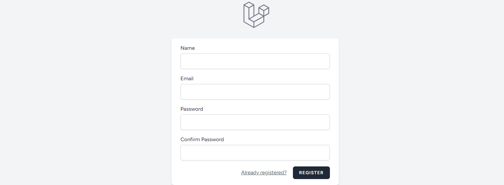
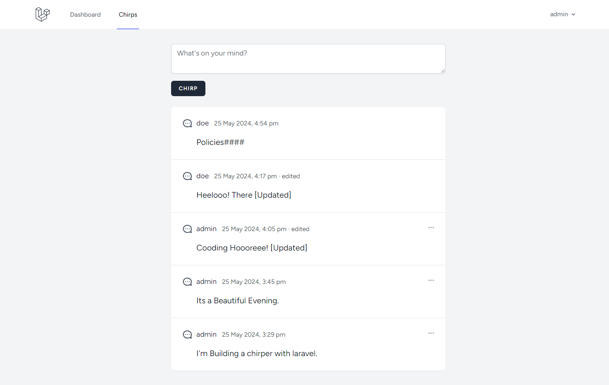

# Laravel Chirper App With Livewire

This App is Written using Laravel Livewire. Component based Alterative to Blade And Inertia JS.

## Features Implemented

-   Authentication with Laravel Breeze.
-   Resource based Routing.
-   Mass assignment protection with Eloquent.
-   User Access policy.

## App Screenshots

